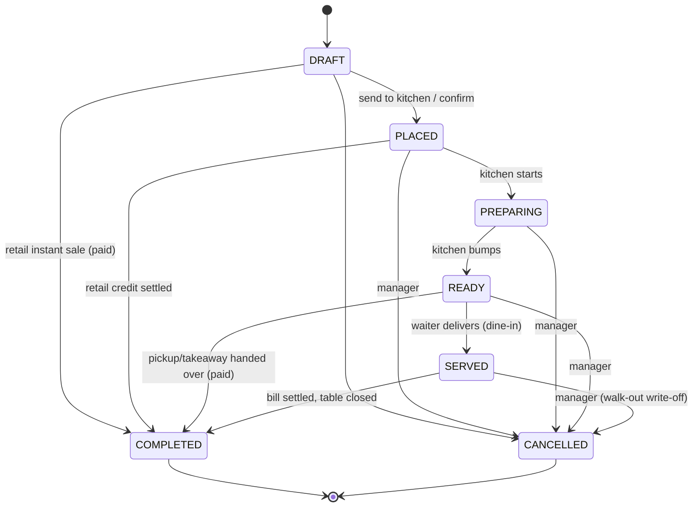

# Order Status Redesign

Full analysis and redesign of the order lifecycle for Pointverse (restaurant + retail POS).
Everything in Part 1 is verified against the code with file references. Part 2 is the proposed design.

---

# Part 1 — What exists today (verified)

## 1.1 The current enum (13 statuses)

`packages/types/src/enums.ts:39` and `apps/api/prisma/schema.prisma:986`:

| Status | Written by | Read by | Verdict |
|---|---|---|---|
| `DRAFT` | Order creation (default) | Everywhere | **Keep** |
| `ON_HOLD` | **Nobody — never written by any code path** | Invoice filters, badge configs | **Dead — remove** |
| `PENDING` | Retail partial payment (`orders.service.ts:1188`), POS "confirm without payment" | Reports treat it as **debts** (`reports.service.ts:674`) | Overloaded — replace with payment status |
| `CONFIRMED` | **Nobody — never written by any code path** | KDS button config, filters, badges | **Dead — remove** |
| `SENT_TO_KITCHEN` | `sendToKitchen` (`orders.service.ts:1807`) | KDS, tables, mobile | Keep (rename `PLACED`) |
| `IN_PROGRESS` | KDS "Start Cooking" | KDS, tables | Keep (rename `PREPARING`) |
| `READY` | KDS "Mark Ready" | KDS, tables, mobile | **Keep** |
| `PAID` | Restaurant full payment (`orders.service.ts:1150`) | Tables "BILLING" state, KDS | Payment state — move to `paymentStatus` |
| `PARTIALLY_PAID` | Restaurant partial payment (`orders.service.ts:1151`) | Tables, reports | Payment state — move to `paymentStatus` |
| `COMPLETED` | Payment (retail), status endpoint, KDS | Revenue reports, refunds | **Keep** |
| `PARTIALLY_REFUNDED` | Refund flow (`refunds.service.ts:662`) | Reports, badges | Payment state — move to `paymentStatus` |
| `FULLY_REFUNDED` | Refund flow (`refunds.service.ts:654`) | Reports, badges | Payment state — move to `paymentStatus` |
| `CANCELLED` | Status endpoint | Everywhere | **Keep** |

**7 of 13 statuses either are never written (`ON_HOLD`, `CONFIRMED`) or encode payment/refund state in the fulfillment axis (`PENDING`, `PAID`, `PARTIALLY_PAID`, `PARTIALLY_REFUNDED`, `FULLY_REFUNDED`).**

## 1.2 Bugs and inconsistencies found

1. **Two conflicting "active order" lists.**
   `table-status.service.ts:18-25` excludes `PAID`/`PARTIALLY_PAID`; `tables.service.ts:23-32` includes them. Consequence: completing one order on a table calls `markTableAvailableIfPossible`, which ignores a second order that is `PAID`-awaiting-close → **the table is freed while a bill is still open**, yet the floor plan still renders it as billing.

2. **`SENT_TO_KITCHEN` orders cannot be cancelled — by anyone.** The restaurant transition map (`orders.service.ts:163-182`) has no `SENT_TO_KITCHEN → CANCELLED`. This is the bug that broke mobile cancellation. Real restaurants need manager cancellation after fire.

3. **POS "Confirm without payment" is broken for restaurants.** `useOrderActions.ts:443-446` sends `DRAFT → PENDING`, which the restaurant map rejects (`DRAFT → [CONFIRMED, SENT_TO_KITCHEN, CANCELLED]` only). Latent 400.

4. **KDS query doesn't filter by status.** `kitchen.service.ts:95-101` fetches *all* orders from the last 24 h — the comment "kitchen-relevant statuses" is a lie; cancelled and completed retail orders ship to kitchen clients.

5. **Kitchen can close bills.** KDS config (`kitchen/config.ts:80-87`) offers "Complete Order" from `READY`/`PAID`, and the backend exempts restaurants from the paid-in-full guard on `COMPLETED` (`orders.service.ts:688-704`). Kitchen staff completing unpaid orders bypasses the cashier entirely.

6. **`OrderItemTicket.status` reuses the 13-value `OrderStatus`** (`schema.prisma:607`) for what is a 3-state ticket lifecycle (queued → preparing → ready). `order-item.service.ts:145` even checks tickets for `PENDING`, a status tickets never receive.

7. **`PATCH /orders/:id/status` has no DTO.** `orders.controller.ts:140` types the body inline (`{ status: OrderStatus }`) — no `@IsEnum` validation, any string reaches the service (violates CLAUDE.md §4). Same for `updateDiscount`, `transfer-table`, `merge`.

8. **Reports use raw status strings** (`reports.service.ts` — 30+ occurrences of `'COMPLETED'`, `'PENDING'`, `'PARTIALLY_PAID'` as string literals, not enum constants). `PENDING` is interpreted globally as "debt", which is only true for retail.

9. **Editable/active status sets are duplicated at least 6×** inside `orders.service.ts` alone (lines 1572, 1836, 2088, 2652, 2688, 2831, 3110) plus the two table lists — each slightly different.

10. **No transition audit trail.** Only `ORDER_CANCELLED` is logged (via `@LogActivity`); every other transition is unrecorded.

## 1.3 Current side-effect map

| Trigger | Side effect | Where |
|---|---|---|
| `COMPLETED` (non-restaurant payment / status endpoint) | Inventory deduction (post-commit), loyalty earn | `orders.service.ts:735-745`, `1530` |
| `COMPLETED` / `CANCELLED` | Table release attempt | `orders.service.ts:717-730` |
| `sendToKitchen` | Ticket rows created, `kitchen.order.created` event → Socket.IO `branch_{branchId}` | `orders.service.ts:1789-1817` |
| Any `updateStatus` | `kitchen.order.updated` event | `orders.service.ts:748` |
| Full/partial refund | Order status overwritten to `*_REFUNDED` | `refunds.service.ts:650-665` |
| Payment settle | Receipt auto-print (client-side) | `useOrderActions.ts:344` |

---

# Part 2 — Proposed design

## 2.1 Two independent state machines

**The single biggest fix: split fulfillment from money.** An order's kitchen progress and its payment state are orthogonal — a dine-in order is routinely *served but unpaid*, and a retail credit sale is *completed-flow but unpaid*. Today both facts fight over one column.

### Fulfillment — `OrderStatus` (7 values)

| Status | Meaning | Why it earns its place |
|---|---|---|
| `DRAFT` | Being built on POS/mobile; not visible to kitchen | Only fully-editable state; the cart |
| `PLACED` | Committed: sent to kitchen (restaurant) or confirmed unpaid (retail credit sale) | The "point of no free edit"; kitchen ticket prints here |
| `PREPARING` | Kitchen actively cooking | KDS working state; drives table "Preparing" |
| `READY` | On the pass, awaiting runner | Waiter notification; drives table "Ready" |
| `SERVED` | **New.** Food delivered; guests dining, bill open | Fixes today's gap where a table shows "Ready" forever until payment; this is the natural home for orders that are currently `PAID`-not-`COMPLETED` |
| `COMPLETED` | Closed: paid in full and service finished | Revenue recognition, inventory deduction, loyalty earn, table release |
| `CANCELLED` | Aborted at any pre-completion point | Terminal; audited |

Statuses deliberately **not** included:
- `ACCEPTED` (kitchen acceptance): starting to cook *is* acceptance. An explicit accept adds a tap with no decision value. Additive later if ever needed.
- `ON_HOLD`: holding is a POS client concern (order tabs in `orderStore`); it never needs server state.
- `SUBMITTED` vs `PLACED`: one name, one state.

### Payment — new `PaymentStatus` column (5 values)

| Status | Meaning |
|---|---|
| `UNPAID` | No payments recorded (default) |
| `PARTIALLY_PAID` | 0 < paid < total due |
| `PAID` | Paid in full |
| `PARTIALLY_REFUNDED` | Some items refunded post-completion |
| `REFUNDED` | Fully refunded |

`paymentStatus` is **derived, never client-set**: recomputed server-side inside the payment/refund transactions from `sum(payments)` and `sum(refunds)` vs `total`. Stored on `Order` for queryability (reports, "debts" lists).

## 2.2 Transition diagram



### Restaurant map

| From | Allowed to |
|---|---|
| `DRAFT` | `PLACED`, `CANCELLED` |
| `PLACED` | `PREPARING`, `CANCELLED`† |
| `PREPARING` | `READY`, `CANCELLED`† |
| `READY` | `SERVED`, `COMPLETED`‡, `CANCELLED`† |
| `SERVED` | `COMPLETED`‡, `CANCELLED`† |
| `COMPLETED`, `CANCELLED` | — (terminal) |

### Retail map

| From | Allowed to |
|---|---|
| `DRAFT` | `PLACED` (credit sale), `COMPLETED`‡, `CANCELLED` |
| `PLACED` | `COMPLETED`‡, `CANCELLED`† |
| `COMPLETED`, `CANCELLED` | — (terminal) |

† = manager/admin only, audited.
‡ = guarded: requires `paymentStatus === PAID` — **now enforced for restaurants too** (removes the exemption at `orders.service.ts:688-704`). Unpaid closures become explicit manager `CANCELLED` (write-off) instead of silent unpaid `COMPLETED`.

Forbidden by construction: any backward move (`READY → DRAFT`), any exit from terminals (`COMPLETED → PREPARING`, `CANCELLED → *`).

## 2.3 Ownership / permission matrix (enforced server-side)

| Transition | ADMIN | MANAGER | CASHIER | WAITER | KITCHEN |
|---|---|---|---|---|---|
| `DRAFT → PLACED` | ✅ | ✅ | ✅ | ✅ | — |
| `DRAFT → CANCELLED` | ✅ | ✅ | ✅ | ✅ | — |
| `DRAFT/PLACED → COMPLETED` (retail, via payment) | ✅ | ✅ | ✅ | — | — |
| `PLACED → PREPARING` | ✅ | ✅ | — | — | ✅ |
| `PREPARING → READY` | ✅ | ✅ | — | — | ✅ |
| `READY → SERVED` | ✅ | ✅ | ✅ | ✅ | — |
| `READY/SERVED → COMPLETED` | ✅ | ✅ | ✅ | — | — |
| `PLACED/PREPARING/READY/SERVED → CANCELLED` | ✅ | ✅ | — | — | — |

Kitchen **loses** the ability to complete orders (fixes bug 5). Cancellation after fire notifies the kitchen via the existing `kitchen.order.updated` event.

Implementation: a pure module `order-status.ts` (pattern: `common/role-authorization.ts` — self-contained, defense-in-depth, decision-table spec) exporting:

```ts
assertTransition(businessType, from, to)          // throws BadRequestException
assertRoleCanTransition(role, from, to)           // throws ForbiddenException
ACTIVE_ORDER_STATUSES  // [DRAFT, PLACED, PREPARING, READY, SERVED] — THE single list
EDITABLE_STATUSES      // see §2.6
```

The canonical status arrays live in `@repo/types` so POS desktop, mobile, and API share one source (kills the 8 divergent copies).

## 2.4 Table logic (single source of truth)

- A table is **in service** iff it has ≥1 order in `ACTIVE_ORDER_STATUSES`. `COMPLETED` and `CANCELLED` are the only exits — this fixes bug 1 because a served-unpaid order is `SERVED` (active) rather than `PAID` (ambiguously active).
- Floor-plan UI states derive as: `PREPARING`←(PLACED|PREPARING), `READY`←READY, `BILLING`←(SERVED ∧ paymentStatus ∈ {UNPAID, PARTIALLY_PAID, PAID}), else `OCCUPIED`.
- Both `TableStatusService.ACTIVE_ORDER_STATUSES` and `tables.service.ts` `OVERVIEW_ORDER_STATUSES` are deleted in favor of the shared constant.

## 2.5 Payment integration

`processPayment` **stops writing fulfillment status** except one case:

- Every payment recomputes and writes `paymentStatus` (inside the existing transaction).
- **Retail**: when `paymentStatus` becomes `PAID`, auto-advance `DRAFT/PLACED → COMPLETED` (instant sale — current behavior preserved).
- **Restaurant**: payment never moves fulfillment status. The order completes when the cashier closes it (`SERVED → COMPLETED`, guard checks `PAID`). POS auto-sends the close right after full settlement for counter flows, so no extra tap in practice.

Refunds set `paymentStatus → PARTIALLY_REFUNDED/REFUNDED` and **leave the order `COMPLETED`** (an order that happened but was refunded still happened; today's status overwrite loses the completion fact).

## 2.6 Editing rules

| Status | Add items | Change qty / remove | Discounts |
|---|---|---|---|
| `DRAFT` | ✅ | ✅ | ✅ |
| `PLACED` / `PREPARING` / `READY` / `SERVED` | ✅ (new items fire new kitchen tickets) | Manager only (audited) | Manager only |
| `COMPLETED` / `CANCELLED` | ❌ — refund module is the only mutation path | ❌ | ❌ |

One `EDITABLE_STATUSES` constant replaces the six inline `Set`s in `orders.service.ts`.

## 2.7 Kitchen workflow (KDS)

- KDS query filters to `status ∈ [PLACED, PREPARING, READY]` server-side (fixes bug 4).
- KDS actions: `PLACED →` "Start Cooking" `→ PREPARING →` "Mark Ready" `→ READY`. Nothing else. No payment, no complete, no table actions.
- `OrderItemTicket.status` gets its own enum: `TicketStatus { QUEUED, PREPARING, READY }` (fixes bug 6). Bump timestamp logic unchanged.
- Kitchen is notified of post-fire cancellations through the existing `kitchen.order.updated` event + a KDS "CANCELLED" banner on the ticket.

## 2.8 Inventory integration

**Deduct on `COMPLETED`, post-commit — keep the current model.** Rationale:
- Deducting at `PLACED` requires compensating restock on every cancel/edit — more failure modes.
- Deduction and refund-restock stay symmetric around the same event (completion / refund).
- The existing post-commit, outside-the-transaction placement (deadlock avoidance, documented in `orders.service.ts`) is preserved as-is.
- Cancelled-after-preparation waste is a manual `MANUAL_ADJUST` stock adjustment (already exists) — an explicit human decision, not an automatic write-off.

## 2.9 Printing & notifications

| Event | Action | Duplicate guard |
|---|---|---|
| `DRAFT → PLACED` | Kitchen ticket rows (KDS) | Already exists: items with a ticket are skipped (`orders.service.ts:1780`) |
| `paymentStatus → PAID` | Receipt auto-print (client, existing) | Existing `paymentLockRef` |
| `READY` | Waiter notification (mobile poll today; socket later) | n/a |
| Post-fire `CANCELLED` | KDS banner via `kitchen.order.updated` | n/a |

No print on `COMPLETED` (receipt already printed at payment).

## 2.10 Database & Prisma changes

```prisma
enum OrderStatus {          // 13 → 7
  DRAFT
  PLACED
  PREPARING
  READY
  SERVED
  COMPLETED
  CANCELLED
}

enum PaymentStatus {
  UNPAID
  PARTIALLY_PAID
  PAID
  PARTIALLY_REFUNDED
  REFUNDED
}

enum TicketStatus {
  QUEUED
  PREPARING
  READY
}

model Order {
  // ...existing fields...
  status        OrderStatus   @default(DRAFT)
  paymentStatus PaymentStatus @default(UNPAID)
  placedAt      DateTime?     // set on DRAFT → PLACED
  servedAt      DateTime?     // set on READY → SERVED
  // completedAt already exists
  statusHistory OrderStatusHistory[]
  @@index([tenantId, branchId, status])
  @@index([tenantId, paymentStatus])
}

model OrderStatusHistory {   // "log every transition"
  id        String      @id @default(uuid())
  orderId   String
  from      OrderStatus
  to        OrderStatus
  userId    String?
  createdAt DateTime    @default(now())
  order     Order       @relation(fields: [orderId], references: [id], onDelete: Cascade)
  @@index([orderId, createdAt])
}

model OrderItemTicket {
  status TicketStatus @default(QUEUED)   // was OrderStatus
  // ...unchanged...
}
```

`@repo/types` mirrors all three enums as const objects (+ `ACTIVE_ORDER_STATUSES`, `EDITABLE_STATUSES`, terminal sets), then `pnpm --filter @repo/types build`.

## 2.11 Data migration (old → new)

| Old status | New `status` | New `paymentStatus` |
|---|---|---|
| `DRAFT` | `DRAFT` | derived from payments (normally `UNPAID`) |
| `ON_HOLD` | `DRAFT` | derived |
| `PENDING` | `PLACED` | derived (`UNPAID`/`PARTIALLY_PAID` — preserves "debts") |
| `CONFIRMED` | `PLACED` | derived |
| `SENT_TO_KITCHEN` | `PLACED` | derived |
| `IN_PROGRESS` | `PREPARING` | derived |
| `READY` | `READY` | derived |
| `PARTIALLY_PAID` | `SERVED` | `PARTIALLY_PAID` |
| `PAID` | `SERVED` | `PAID` |
| `COMPLETED` | `COMPLETED` | `PAID` (or refund-adjusted) |
| `PARTIALLY_REFUNDED` | `COMPLETED` | `PARTIALLY_REFUNDED` |
| `FULLY_REFUNDED` | `COMPLETED` | `REFUNDED` |
| `CANCELLED` | `CANCELLED` | derived |

"Derived" = one backfill pass computing `paymentStatus` from `sum(payments)` / `sum(refund totals)` vs `total`.

**Migration mechanics** (Postgres can't remove enum values in place):
1. Migration A (additive): add `PaymentStatus`/`TicketStatus` enums, `paymentStatus` + timestamps + `OrderStatusHistory`; add `PLACED`, `PREPARING`, `SERVED` to the existing `OrderStatus` enum.
2. Backfill SQL: the mapping table above + payment-status computation.
3. Migration B (contract): create the 7-value enum, `ALTER COLUMN ... TYPE ... USING`, drop the old enum. Ticket statuses map `SENT_TO_KITCHEN→QUEUED`, `IN_PROGRESS→PREPARING`, `READY→READY`, anything else → `QUEUED`.
4. If there is no production data yet, A+B collapse into a single migration.

## 2.12 API changes

| Endpoint | Change |
|---|---|
| `PATCH /orders/:id/status` | Add `UpdateOrderStatusDto` (`@IsEnum(OrderStatus)`) — fixes bug 7. Route through the new transition module with role check (`@CurrentRole()`). |
| `POST /orders/:id/send-to-kitchen` | Sets `PLACED` + `placedAt`; unchanged contract. |
| `POST /orders/:id/payment` | Writes `paymentStatus`; retail auto-complete; restaurant no fulfillment write. Response gains `paymentStatus`. |
| `GET /kitchen/orders` | Server-side `status ∈ [PLACED, PREPARING, READY]` filter. |
| Refund endpoints | Write `paymentStatus`, never `status`. |
| Reports service | Replace raw strings: revenue = `status: COMPLETED`; debts = `paymentStatus ∈ [UNPAID, PARTIALLY_PAID] ∧ status ∈ [PLACED, SERVED]`; refund reports key on `paymentStatus`. Import enum constants. |
| `GET /orders` filters | Accept `paymentStatus` as a new query filter. |

All transitions logged to `OrderStatusHistory` inside the update transaction; manager cancellations keep the existing `@LogActivity(ORDER_CANCELLED)` audit.

## 2.13 Frontend updates

**POS desktop**
- `kitchen/config.ts`: action map → `PLACED: Start Cooking`, `PREPARING: Mark Ready`; remove `READY/PAID → Complete Order`, `CONFIRMED`, `PARTIALLY_PAID`, `FULLY_REFUNDED` entries.
- `tables/config.ts`: `deriveTableUiStatus` takes `(orderStatus, paymentStatus)`; `BILLING` derives from `paymentStatus`.
- `useOrderActions.ts`: "confirm without payment" sends `DRAFT → PLACED` (fixes bug 3); offline queue payloads updated.
- `invoices/*`, `orders/config.ts`, `reports/OrdersByStatusChart.tsx`, `customers/$customerId.tsx`: drop `ON_HOLD`/`CONFIRMED`/`SENT_TO_KITCHEN`/`PAID`... badges; add `PLACED`/`PREPARING`/`SERVED`; show a separate payment badge (`Unpaid`/`Partial`/`Paid`/`Refunded`) next to the fulfillment badge.
- Status filter dropdowns: 7 fulfillment options + independent payment filter.

**Mobile**
- `lib/format.ts`: 7-entry style map + payment badge styles.
- `order/[id].tsx`: `CANCELLABLE` = manager-gated set from shared constants; add "Mark Served" on `READY`; "Close Order" replaces terminal handling.
- `(tabs)/index.tsx`, `orders.tsx`: `ACTIVE_STATUSES` imported from `@repo/types`, revenue chip keys on `COMPLETED`.

## 2.14 Tests

1. `order-status.spec.ts` (decision table, co-located, pattern of `role-authorization.spec.ts`):
   - all 7×7 from→to pairs × {RESTAURANT, RETAIL} — assert exact allow/deny.
   - permission matrix: every transition × every `UserRole`.
2. `orders.service.spec.ts` additions:
   - `COMPLETED` rejected while `paymentStatus ≠ PAID` (both business types — the restaurant exemption is gone).
   - table released only when no sibling order is in `ACTIVE_ORDER_STATUSES` (regression for bug 1).
   - `OrderStatusHistory` row written per transition.
   - refund leaves `status = COMPLETED`, flips `paymentStatus`.
3. Payment-status derivation table: (payments, refunds, total) → expected `PaymentStatus`.

## 2.15 Rollout order

1. `@repo/types`: new enums + shared status sets → build.
2. Prisma migrations + backfill (§2.11).
3. API: transition module + specs → rewire `OrdersService.updateStatus`, payment, refunds, kitchen, tables → delete all inline status sets.
4. POS desktop, then mobile (each compiles against the rebuilt `@repo/types`).
5. Sweep: `grep -r 'ON_HOLD\|CONFIRMED\|SENT_TO_KITCHEN\|IN_PROGRESS\|PARTIALLY_REFUNDED\|FULLY_REFUNDED\|PARTIALLY_PAID'` must return zero hits outside migrations.
